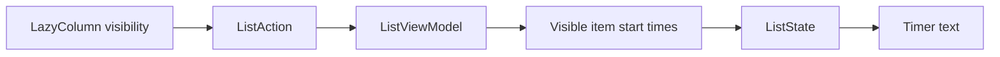

# Milliscope


Milliscope is a tiny Jetpack Compose lab for measuring how long `LazyColumn`
items stay visible on screen.

It renders a scrollable Material 3 list where every row keeps its own visibility
timer. Scroll an item into view, leave it there, scroll it away, bring it back:
the app keeps accumulating the time that row has actually spent visible.

I built it while exploring the
[Compose UI 1.9 visibility APIs](https://android-developers.googleblog.com/2025/08/whats-new-in-jetpack-compose-august-25-release.html)
and wrote about the experiment in
[Visibility APIs in Jetpack Compose 1.9](https://medium.com/@sotti/visibility-apis-in-jetpack-compose-1-9-easier-cleaner-but-not-quite-there-yet-9bbfdb60bd6b).

## Screenshots

| Light | Dark |
| --- | --- |
|  |  |

## What It Demonstrates

- Detecting which `LazyColumn` rows enter and leave the viewport.
- Accumulating visible time across multiple visibility sessions.
- Updating active timers every 100 ms without losing off-screen totals.
- Keeping UI state in a `ViewModel` backed by `StateFlow`.
- Testing time-based behavior with an injected elapsed-realtime clock.
- Comparing a `snapshotFlow` approach with `Modifier.onVisibilityChanged`.

## How It Works



The current `main` branch observes `LazyListState.layoutInfo.visibleItemsInfo`
with `snapshotFlow`, converts visible-index changes into item visibility
actions, and lets the `ListViewModel` own the timing rules. Visible items are
updated by a 100 ms ticker; hidden items keep their accumulated total until they
become visible again.

## Branches

| Branch | Approach | Why It Exists |
| --- | --- | --- |
| [`main`](https://github.com/Sottti/Milliscope/tree/main) | Lifecycle-aware `snapshotFlow` over `LazyListState.layoutInfo` | Current cleaned-up implementation and default README branch. |
| [`snapshot`](https://github.com/Sottti/Milliscope/tree/snapshot) | Earlier snapshot/list-state experiment | Baseline implementation before the newer API comparison. |
| [`onVisibilityChanged`](https://github.com/Sottti/Milliscope/tree/onVisibilityChanged) | `Modifier.onVisibilityChanged(minDurationMs = 0, minFractionVisible = 1f)` | Direct experiment with the Compose UI 1.9 visibility modifier. |

## Run It

```bash
./gradlew :app:assembleDebug
./gradlew :app:installDebug
```

## Test It

```bash
./gradlew :app:testDebugUnitTest
```

The unit tests cover the timing rules: visible segments accumulate, hidden items
stop accruing, repeated list visibility events do not double-count, and multiple
items accrue independently.

## Stack

- Kotlin 2.3.20
- Jetpack Compose BOM 2026.03.01
- Material 3
- Android Gradle Plugin 9.1.0
- Coroutines 1.10.2
- Lifecycle ViewModel Compose
- JUnit 4
- Java 17
- min SDK 28, target SDK 36

## Status

Milliscope is an experimental sample app, not a production library. It is meant
to stay small enough to read, tweak, and use as a reference when thinking about
visibility tracking in Compose.

No license has been published yet.
